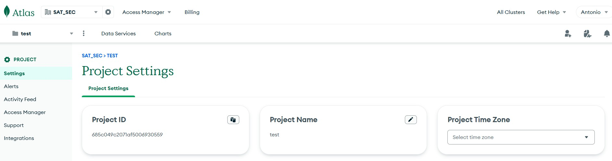

## **Step-by-Step Guide: Configure Azure Managed Identity for Local JavaScript Application to Connect to MongoDB Atlas**

This guide explains how to set up **Azure Managed Identity**, configure **MongoDB Atlas**, retrieve necessary variables using **Azure CLI**, and build a JavaScript application running locally that authenticates using the Managed Identity.

---

### **Pre-Requisites**
Ensure the following conditions are met:
1. **Azure CLI** is installed and set up on your local machine (version 2.37.0 or later).
2. Node.js is installed on your machine.
3. A MongoDB Atlas cluster is ready, and **Atlas Service Connector** is enabled.
4. Your Azure account has IAM permission to create resources like Managed Identities.

---

---

### **Step 1: Set Up Azure Managed Identity**

Azure Managed Identity is required to securely authenticate your application with MongoDB Atlas. Since your application is running locally, you’ll simulate a Managed Identity configuration.

#### **Step 1-A: Retrieve Azure Subscription, Tenant, and Resource Group Details**
To retrieve necessary Azure details:

1. **Login to Azure** via CLI if you’ve not done so:
   ```bash
   az login
   ```
   This opens a browser for you to authenticate. You may use a Service Principal (e.g., if working in a CI/CD pipeline):
   ```bash
   az login --service-principal -u <APP_ID> -p <PASSWORD_OR_CERTIFICATE> --tenant <TENANT_ID>
   ```

   Verify the Tenant Context: Ensure that you are operating in the correct Azure Active Directory tenant. Run the following command to confirm your current tenant:
   ```bash
   az account show
   ```
   output: 
   ```json
   {
        "environmentName": "AzureCloud",
        "homeTenantId": "c96563a8-841b-4ef9-af16-33548de0c958",
        "id": "3f4b9218-7a1e-4247-a424-2c1f9db20f5c",
        "isDefault": true,
        "managedByTenants": [],
        "name": "MDB-IndustrySolutions",
        "state": "Enabled",
        "tenantDefaultDomain": "mongodb0.onmicrosoft.com",
        "tenantDisplayName": "mongodb.com",
        "tenantId": "c96563a8-841b-4ef9-af16-33548de0c958",
        "user": {
            "name": "antonio.membrides@mongodb.com",
            "type": "user"
        }
   }
   ```

2. Retrieve **Subscription ID**:
   ```bash
   az account show --query id --output tsv
   ```

3. Retrieve **Tenant ID**:
   ```bash
   az account show --query tenantId --output tsv
   ```

   ```bash
    az account list-locations --output table

    DisplayName               Name                 RegionalDisplayName
    ------------------------  -------------------  -------------------------------------
    East US                   eastus               (US) East US
    West US 2                 westus2              (US) West US 2
   ```

4. If you don’t have a Resource Group, create one:
   ```bash
   az group create --name <RESOURCE_GROUP_NAME> --location <LOCATION>
   ```
   Example:
   ```bash
    az group create --name satRscGrp --location eastus
   ```
   output:
   ```json
   {
        "id": "/subscriptions/3f4b9218-7a1e-4247-a424-2c1f9db20f5c/resourceGroups/satRscGrp",
        "location": "eastus",
        "managedBy": null,
        "name": "satRscGrp",
        "properties": {
            "provisioningState": "Succeeded"
        },
        "tags": {
            "CreatedOnDate": "2025-08-17T15:58:50.5817257Z"
        },
        "type": "Microsoft.Resources/resourceGroups"
    }
    ```

---

#### **Step 1-B: Create Managed Identity**  

Here, you'll create a **user-assigned Managed Identity** since you are manually assigning it. Run the following command to create the Identity:

```bash
az identity create --name <MANAGED_IDENTITY_NAME> --resource-group <RESOURCE_GROUP_NAME> --location <LOCATION>
```

Example:
```bash
az identity create --name satMngID --resource-group satRscGrp --location eastus
```
output:
```json
{
    "clientId": "ea69b431-c7a4-422b-bff5-a68baf5cb7ba",
    "id": "/subscriptions/3f4b9218-7a1e-4247-a424-2c1f9db20f5c/resourcegroups/satRscGrp/providers/Microsoft.ManagedIdentity/userAssignedIdentities/satMngID",
    "location": "eastus",
    "name": "satMngID",
    "principalId": "b3962d99-9aa0-4f2c-8687-086d689ad886",
    "resourceGroup": "satRscGrp",
    "systemData": null,
    "tags": {
    "CreatedOnDate": "2025-08-17T16:03:14.1892990Z"
    },
    "tenantId": "c96563a8-841b-4ef9-af16-33548de0c958",
    "type": "Microsoft.ManagedIdentity/userAssignedIdentities"
}
```

---

#### **Step 1-C: Retrieve Managed Identity Variables**

Once the Managed Identity is created, retrieve the key variables:

1. List Managed Identities to find **clientId** and **principalId**:
   ```bash
   az identity list --resource-group <RESOURCE_GROUP_NAME> --output table
   ```
    Example:
   ```sh
   az identity list --resource-group satRscGrp --output json
   ```
   output:
   ```json
   [
        {
            "clientId": "ea69b431-c7a4-422b-bff5-a68baf5cb7ba",
            "id": "/subscriptions/3f4b9218-7a1e-4247-a424-2c1f9db20f5c/resourcegroups/satRscGrp/providers/Microsoft.ManagedIdentity/userAssignedIdentities/satMngID",
            "location": "eastus",
            "name": "satMngID",
            "principalId": "b3962d99-9aa0-4f2c-8687-086d689ad886",
            "resourceGroup": "satRscGrp",
            "systemData": null,
            "tags": {
            "CreatedOnDate": "2025-08-17T16:03:14.189299Z",
            "mongodb_infosec_creator": "antonio.membrides@mongodb.com"
            },
            "tenantId": "c96563a8-841b-4ef9-af16-33548de0c958",
            "type": "Microsoft.ManagedIdentity/userAssignedIdentities"
        }
    ]
    ```

2. Key variables retrieved from the output:
   - `clientId`: Application ID of the identity.
   - `principalId`: Object ID of the identity.
   - `id`: Full Resource ID.

---

---

### **Step 2: Configure MongoDB Atlas for Azure Integration**

#### **Step 2-A: Log in to MongoDB Atlas**
Visit [Atlas Dashboard](https://cloud.mongodb.com) and log in to your account. Select the appropriate **project** and **cluster**.

---

#### **Step 2-B: Configure Identity Provider**
1. Go to **Security > Access Manager**.
2. Click **Add Identity Provider** and select **Azure**.
3. Provide the following Azure details:
   - **clientId** (Managed Identity's `clientId`, retrieved in Step 1-C).
   - **Tenant ID** (retrieved in Step 1-A).
   - MongoDB **Project ID**:
     - In Atlas Dashboard, go to **Settings > Project**, and copy the displayed Project ID.
     

4. CLI Interactions

    To authenticate using your Atlas username and password on a new profile, run:
    ```sh
    atlas auth login --profile demo
    
    # To verify your account, copy your one-time verification code:
    # M64T-6KJK
    ```
    To set credentials using API keys, run:
    ```sh
    atlas --profile my-profile clusters list
    ```

    ```sh
    atlas --profile demo clusters list
    ```


5. Map roles for the Managed Identity:
   - Define which **database roles** and **databases** the Managed Identity can access.
   - For example, you might map it to the `readWrite` role for specific databases.

---

---

### **Step 3: Set Up JavaScript Application**

Create a Node.js application to authenticate locally using Azure Managed Identity and connect to MongoDB Atlas.

---

#### **Step 3-A: Install Dependencies**
Install necessary libraries:

```bash
npm install @azure/identity mongodb dotenv
```

---

#### **Step 3-B: JavaScript Code**

Here’s the complete code to access MongoDB Atlas using Azure Managed Identity:

```javascript
const { TokenCredentialAuthentication } = require('mongodb'); // For MongoDB Atlas authentication
const { DefaultAzureCredential } = require('@azure/identity'); // For Azure Managed Identity
require('dotenv').config(); // For environment variables

async function main() {
    try {
        // Azure Managed Identity configuration
        const azureCredential = new DefaultAzureCredential();
        const token = await azureCredential.getToken("https://sts.windows.net/.default"); // Azure AD scope

        // MongoDB Atlas connection string
        const mongoClient = new TokenCredentialAuthentication({
            uri: "mongodb+srv://<ATLAS_CLUSTER>.mongodb.net/",
            authSource: "$external",
            mechanism: "PLAIN",
            properties: {
                TOKEN: token.token // Pass Azure AD token
            },
        });

        const database = mongoClient.db("testDatabase");
        const collections = await database.collection("testCollection").find({}).toArray();
        console.log("Collections:", collections);

    } catch (error) {
        console.error("Error connecting to MongoDB Atlas:", error);
    }
}

main();
```

---

#### **Step 3-C: Configure Environment Variables**

Create a `.env` file in your project directory to store sensitive variables.

```plaintext
ATLAS_CLUSTER=<YOUR_CLUSTER_NAME>
MANAGED_IDENTITY_CLIENT_ID=<CLIENT_ID>
AZURE_TENANT_ID=<TENANT_ID>
AZURE_SUBSCRIPTION_ID=<SUBSCRIPTION_ID>
```

Replace `<YOUR_CLUSTER_NAME>`, `<CLIENT_ID>`, `<TENANT_ID>`, and `<SUBSCRIPTION_ID>` with the values retrieved in earlier steps.

---

---

### **Step 4: Debugging**

#### Validate Connectivity:
1. **Validate Node.js functionality** by running:
   ```bash
   node app.js
   ```

2. Check Atlas **Cluster Activity Logs** to see successful connection attempts.

3. If authentication fails:
   - Ensure the Managed Identity has proper permissions in Atlas.
   - Validate the `clientId`, `tenantId`, and other configuration settings.

---

---

### **Security Best Practices**

1. **Environment Variables**: Store sensitive values (like `clientId`) in `.env` rather than hardcoding them in the application.
2. **Role-Based Access**: Minimize MongoDB Atlas access permissions for the Managed Identity to least privilege.

---
